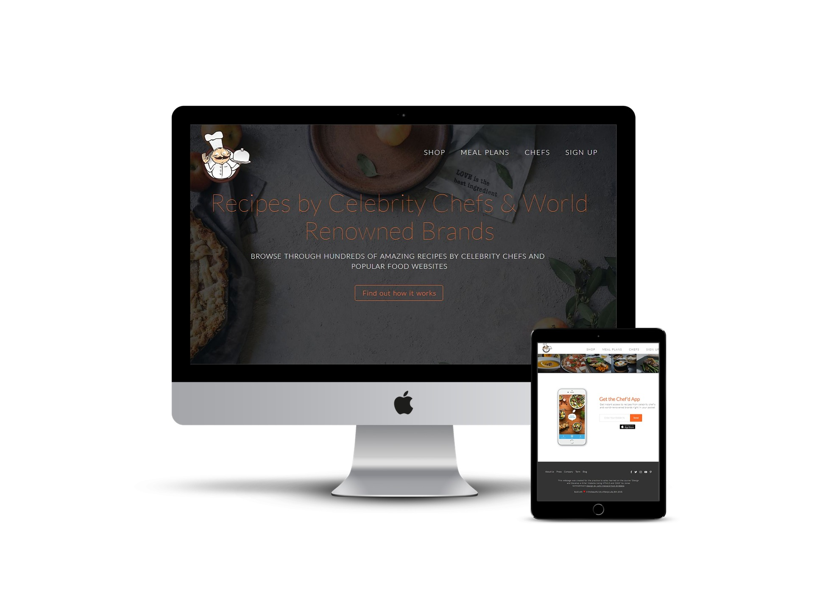

# Food Website

>  Website - [CHEF'D]( https://vladimirblagojevic.github.io/Food-Website/)

---

### Table of Contents

- [Food Website](#food-website)
        - [Table of Contents](#table-of-contents)
    - [Description](#description)
            - [Technologies](#technologies)
    - [References](#references)
    - [License](#license)
    - [Author Info](#author-info)

---

## Description

 Landing page for fictional food service, made to practice Html and Css. This is my first project on the path to become web developer.

#### Technologies

- HTML & CSS
- jQuery

[Back To The Top](#read-me-template)

## References

- Design credits go to John Menard on [Dribbble](https://dribbble.com/shots/3320516-Chef-d-Website)

  
[Back To The Top](#read-me-template)

---

## License

MIT License

Copyright (c) [2018] [Vladimir Blagojevic]

[Back To The Top](#read-me-template)

---

## Author Info

- Twitter - [@Vladimir B.](https://twitter.com/Kvout90)
- Website - [Vladimir B.](https://github.com/VladimirBlagojevic)

[Back To The Top](#read-me-template)

